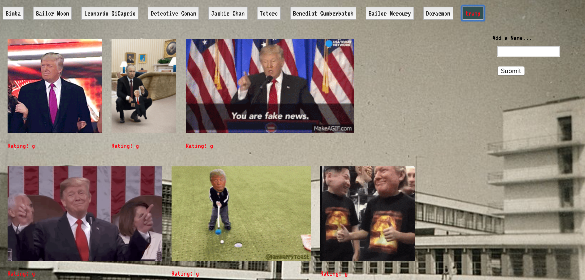

# GifTastic

This is the 6th homework of my GT coding bootcamp.

In this assigment, I made a dynamic web that populates with gifs of user's choice. 

* API I used to build this web: [Giphy API](https://developers.giphy.com/docs/)

What's more, **html**,**css**,**javascript** and **jQuery** were also used in this assignment.

### about GifTastic

 It was the first time I found that I can use a wabpage to express my feelings.

 We were told to choose any topic we like in this assignment. 
 
 At first I thought about some celebrities, but when the names were typed one after another, I realized there was something special happened to our generation. When I were young, amounts of children in China shared the same style childhood --living in a society that full of Soviet Union relics, enjoying Japanese Cartoon and westrn Movies. 

 Language is not enough for me to describe how marvelous these cartoon characters seemed like in such an environment.

 However, this page helped me to explain that.

 

 

 ### Instrutions

 1. Input a new name, and submit it. A new name button will be created.

 2. Click the button, you can get 10 gif images, and once you click any still image, it would animate.
 
 3. Now you can try--think about what you would like to add to my gray-colored childhood!

  

 

